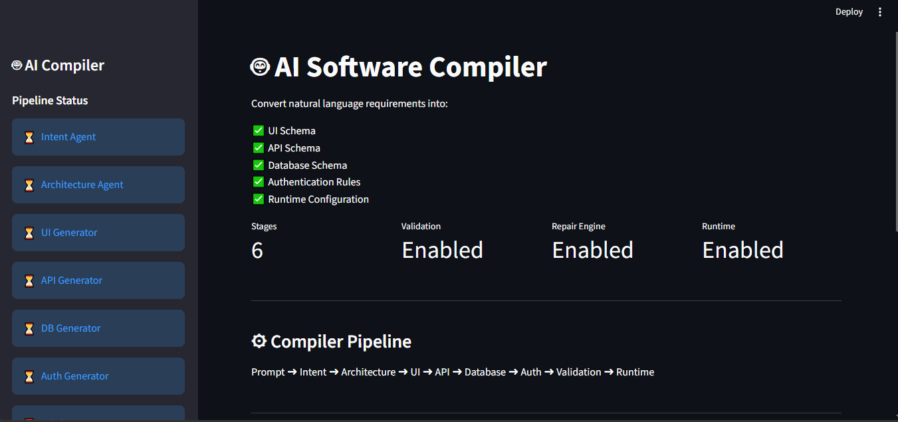
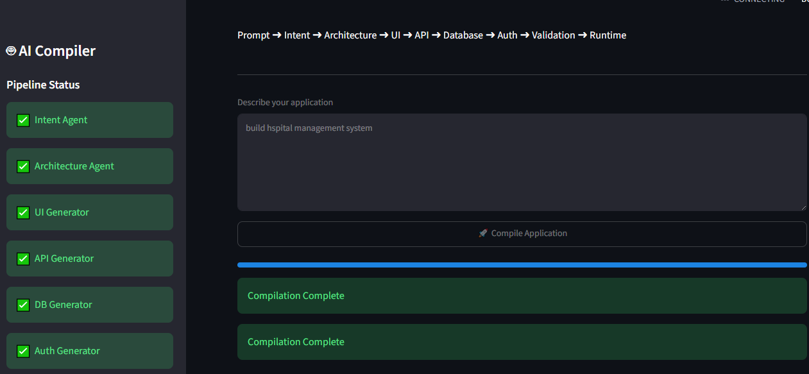
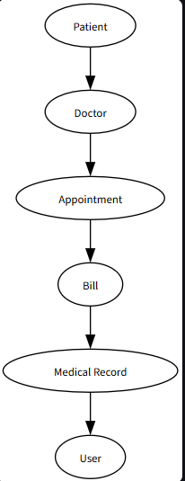
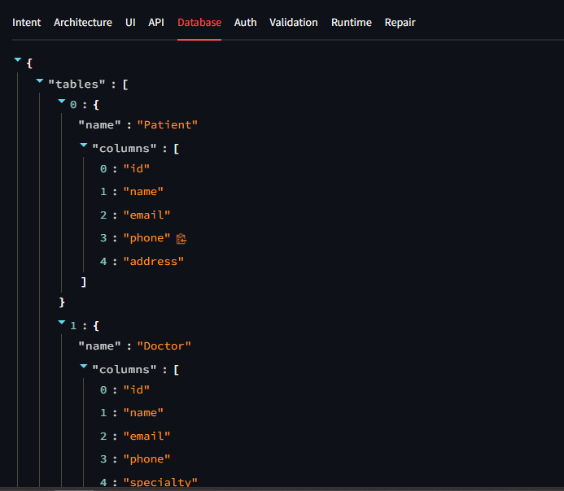

# 🤖 AI Software Compiler

## Overview

AI Software Compiler is a multi-stage AI-powered system that transforms natural language software requirements into structured software artifacts.

Instead of manually creating architecture, APIs, database schemas, authentication rules, and runtime configurations, users can simply describe their application in plain English and the compiler generates the required specifications automatically.

---

## Features

* Natural Language Requirement Processing
* Intent Extraction Agent
* Architecture Generation Agent
* UI Schema Generation
* API Schema Generation
* Database Schema Generation
* Authentication Schema Generation
* Validation Engine
* Repair Engine
* Runtime Configuration Generator
* Interactive Streamlit Dashboard
* Architecture Visualization

---

## System Architecture

```text
User Prompt
      │
      ▼
Intent Agent
      │
      ▼
Architecture Agent
      │
 ┌────┼────┬────┐
 ▼    ▼    ▼    ▼
UI   API  DB  Auth
 │    │    │    │
 └────┴────┴────┘
        │
        ▼
   Validation
        │
        ▼
     Repair
        │
        ▼
     Runtime
```

---

## Technology Stack

### Backend

* Python
* Pydantic
* JSON

### AI Models

* Gemini API
* Groq API (Llama 3.3)

### Frontend

* Streamlit

### Visualization

* Graphviz

### Version Control

* Git
* GitHub

---

## Project Structure

```text
ai_compiler/
│
├── app.py
├── main.py
├── config.py
│
├── pipeline/
│   ├── intent.py
│   ├── architecture.py
│   ├── ui_generator.py
│   ├── api_generator.py
│   ├── db_generator.py
│   ├── auth_generator.py
│   ├── validator.py
│   ├── repair.py
│   ├── runtime.py
│   └── compiler.py
│
├── schemas/
│   └── app_schema.py
│
├── screenshots/
│
└── README.md
```

---

## Installation

Clone the repository:

```bash
git clone <repository-url>
cd ai_compiler
```

Create virtual environment:

```bash
python -m venv venv
```

Activate virtual environment:

```bash
venv\Scripts\activate
```

Install dependencies:

```bash
pip install -r requirements.txt
```

---

## Environment Variables

Create a `.env` file:

```env
GROQ_API_KEY=your_api_key
```

or

```env
GEMINI_API_KEY=your_api_key
```

---

## Running the Project

Run compiler:

```bash
python main.py
```

Run Streamlit dashboard:

```bash
streamlit run app.py
```

---

## Sample Input

```text
Build a CRM system with login, dashboard,
contacts, payments, analytics and
role-based access control.
```

---

## Generated Outputs

The compiler generates:

* Intent Specification
* Architecture Specification
* UI Schema
* API Schema
* Database Schema
* Authentication Rules
* Validation Report
* Repair Report
* Runtime Configuration

---

## Screenshots

### Home Page




### Compilation Pipeline



### Architecture Visualization



### Generated Schemas



---

## Future Enhancements

* Docker Deployment
* Multi-Model Support
* Project Code Generation
* Kubernetes Deployment Templates
* CI/CD Pipeline Generation
* Microservice Architecture Support

---

## Author

**Alekhya M**

Computer Science Engineering Student

AI | Software Engineering

---

## License

This project is developed for educational and research purposes.
